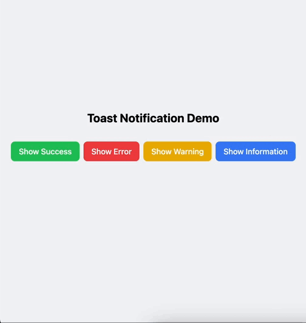

# Custom Toast Notification System

A lightweight, accessible toast notification system built with React and TypeScript. Features stacked notifications, smooth animations, and customizable styles.



## Features

- 🚀 Smooth enter/exit animations using requestAnimationFrame
- 🎨 Four toast types: Success, Error, Warning, Info
- 📚 Stack limit (max 3 toasts)
- ♿️ Accessible with ARIA attributes
- 🎯 TypeScript support
- 🎨 Tailwind CSS styling
- 🔄 Auto-dismiss with configurable duration
- 📱 Responsive design

## Installation

```bash
npm install
```

## Usage

```tsx
import { useToast } from "./providers/ToastProvider";

function App() {
  const { addToast } = useToast();

  const showToast = () => {
    addToast({
      id: Date.now().toString(),
      message: "Hello World",
      type: "success",
      description: "Optional description",
    });
  };

  return (
    <ToastProvider>
      <button onClick={showToast}>Show Toast</button>
      <Toaster />
    </ToastProvider>
  );
}
```

### Toast Types

- `success` - For successful operations
- `error` - For error messages
- `warning` - For warning notifications
- `info` - For general information

### Props

```typescript
interface ToastProps {
  id: string;
  type: "success" | "error" | "warning" | "info";
  message: string;
  description?: string;
  onClose?: () => void;
}
```

## Development

```bash
# Install dependencies
npm install

# Run development server
npm run dev

# Build for production
npm run build
```

## Tech Stack

- React
- TypeScript
- Tailwind CSS
- Vite

## License

MIT
